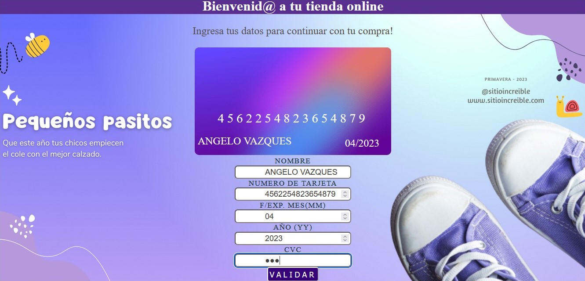

# Tarjeta de crédito válida

## Índice

* [1. Introduccion](#1-introduccion)
* [2. Resumen del proyecto](#2-resumen-del-proyecto)
* [3. Funcionalidad](#3-funcionalidad)
* [4. Decisiones de diseño del proyecto](#4-decisiones-de-diseño-del-proyecto)

***

## 1. Introduccion:

Te presentamos una aplicacion web de una tienda de zapatos para niños, en la cual
podras realizar una compra online, para ello deberas llenar informacion en los campos
que te solicita datos personales como: Nombere de usuario y datos de la tarjeta de
credito/debito.

A mas detalle sobre esta aplicacion web, lo que le permitira al usuario es poder VALIDAR
su tarjeta de credito/debito para poder realizar su compra y a la vez, la tienda podra
corroborar que la informacion que esta llenando el usuario sea el correcto para asi poder
concretar la venta de su producto.

Los campos que debe llenar el usuario de manera obligatorio son: Nombre completo del
cliente y Numero de su tarjeta (informacion importante para validar la tarjeta).
Los demas campos como: Fecha de expiracion de la tarjeta(mes-año) y cvc
(codigo de seguridad de la tarjeta) son datos opcionales que puede o no llenar el ususario.

## 2. Resumen del proyecto:

En esta aplicacion web se podra visualizar una interfaz de usuario que permitira
como ultimo paso, llenar datos personales del cliente como datos de su tarjeta
para concretar una compra online de zapatos para niños.

### Principales usuarios

* Los productos que ofrece la tienda son zapatos para niños en todas las categorias,
  entonces los principales clientes son todos los NIÑOS y NIÑAS desde los 3 años
  de edad. Los usuarios principales son todas aquellas personas mayores de edad que
  cuenten con una tarjeta ya sea de credito o debito y que estan interesados en
  realizar una comprar online el producto ya sea para sus hijos, sobrinos, nietos,
  hermanos, primos, etc.

### Objetivo general del usuario

* Poder validar su tarjeta de credito/debito y asi poder concretar la compra de
  su producto(zapato para niños).

### Resolucion de problemas del usuario

* Poder realizar su compra desde la comodidad de su hogar o desde donde se encuentre
  sin tener que acercarse de manera presencial a la tienda ya que todo el proceso de
  la compra lo hara de forma ONLINE solo ingresando todos sus datos personales y datos
  de su tarjeta de credito/debito, de esta manera el usuario podra solucionar su
  problema principal de "tiempo y espacio".
  
## 3. Funcionalidad:

Te mostrare todas las funcionalidades que tiene esta aplicacion web que tiene como
objetivo principal saber si el numero de la tarjeta es valida o no es valida.

### Datos principales reflejados dentro de la tarjeta 

* Aqui se puede ver que cuando el usuario va digitando su nombre, numero de tarjeta,
  mes y año, al mismo tiempo esos datos se van llenando o reflejando dentro de la
  imagen de la tarjeta.

* Tambien pasa que si el usuario borra los numeros de tarjeta que ingresó o su nombre,
  dento la imagen "tarjeta" esa informacion no quedara vacía, se autocompleta con el
  modelo de plantilla que se muestra al inicio de toda la pagina antes de llenar datos.

### Datos obligatorios 

* La aplicacion web pide al usuario de manera obligatoria que llene dos campos principales
  que son: Nombre y Numero de tarjeta, en caso no llene la informacion de su nombre, al
  presionar el boton de VALIDAR, arrojara un mensaje "Tienes que ingresar tu nombre".

  
  
* En caso no ingrese el numero de su tarjeta, arrojara un mensaje "Tienes que ingresar el
  numero de tu tarjeta".

  

### Ingresando un numero de tarjeta No Válida

* En caso ingresemos un numero de tarjeta inválida o cualquier número al azar, arrojará
  un mensaje "La tarjeta es inválida, intenta otra vez".

  

* Despues de dar click en aceptar dentro del mensaje que dice la tarjeta es inavalida,
  inmediatamente aparece otro mensaje mostrando todos los numeros que ingresó el usuario
  pero enmascarados, excepto los ultimos 4 digitos.
  
  

### Ingresando un numero Válido

* Esta vez ingresamos un numero de tarjeta que si está validada y nos arrojara un mensaje
  "La tarjeta es válida, puedes realizar tu compra".

  

* Inmediatamente despues de darle click al boton aceptar dentro del mensaje que dice que la
  tarjeta es válida, aparece otro mensaje donde muestra todos los numeros enmascarados
  excepto los ultimos 4 digitos. 

  

## 4. Decisiones de diseño de la aplicacion web:

Para diseñar el fondo de la aplicacion web, lo hice en CANVA, buscando colores de fondo
que convinen con el color degradado que tiene la imagen "tarjeta", algunas imagenes tambien
para decorar los bordes del fondo, todo esto dentro de canva.

Al final me decidi por un color de fondo degradado que convina con la imagen "tarjeta", una
imagen grande de unas zapatillas de niño que lo puse en la esquina derecha inferior, otras
pequeñas imagenes de abejita y caracol que adornan los costados y unos textos informativos
sobre la tienda, todo esto con la finalidad de resaltar o hacer ver al usuario que es una
tienda de zapatos para "NIÑOS".
